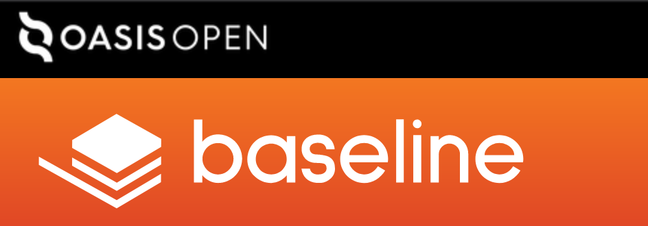

## Open Project Website Guidelines

The project's primary website is often the first place people go to learn about the objectives of your work and how to get involved. Branding for this site should be distinctive for your project, capturing the spirit and culture of your community. Content should be compelling, clear, and easily navigated.

OASIS offers a hosted domain, content management system, design template, and logo for all Open Projects. If you’re starting your project fresh or looking to upgrade your web presence, OASIS staff can help with the set-up of your primary website.

If your project already has its own website, you have the option to transfer it to an OASIS-hosted domain or continue on the domain you’re using, provided OASIS staff are given admin access. Migration and adherence to the OASIS design template is not required.

To ensure consistency and fair disclosure, all Open Projects should incorporate the minimum required content described here.

### Headers

Use of the OASIS OPEN PROJECTS header is recommended (but not required).

A small version of the OASIS OPEN PROJECTS logo should appear at the top of your project’s homepage, above the main navigation. Typically, the logo will be placed in the upper left corner on a black rule that runs the width of the page. The [OASIS OPEN PROJECTS logo](../../../tree/master/img/open-project-logos) should be approximately one third the height of the project’s logo.

### Footers

Project web pages should include a footer with this notice:

{PROJECT NAME} ​© is an [OASIS Open Project](https://www.oasis-open.org/open-projects/). All rights reserved. OASIS [trademark](https://www.oasis-open.org/policies-guidelines/trademark), [IPR](https://www.oasis-open.org/policies-guidelines/ipr), [privacy](https://www.oasis-open.org/policies-guidelines/privacy), and other [policies](https://www.oasis-open.org/policies-guidelines) apply. [Contact OASIS](mailto:communications@oasis-open.org) for details.

The footer also may include the OASIS Open Projects logo. 

The footer may be modified for projects that need to cite additional policies or contact details. All changes should be reviewed with OASIS staff.

### Required content

**About.** “{PROJECT NAME} is an [OASIS Open Project](https://oasis-open-projects.org/)” should be included in the About statement, which may appear on the project’s homepage or a separate page on the primary site. The About statement may also be used on other public pages, such as README files in GitHub.

**GitHub link.** A link to the project's GitHub site must be provided on the primary website.
  
**Charter.** OASIS staff will publish the official charter on the project's GitHub site. The primary website should contain a link to this charter.

**Leadership.** OASIS staff will publish the official roster for the Project Governing Board (PGB) on the GitHub site, including the names and corporate affiliations of all current PGB members. The primary website may also showcase PGB members and include photos and/or bios. Rosters for the Technical Steering Committee and any other official project working groups may be published on the GitHub site or primary website. GitHub teams for the project’s leadership groups may also be created.

**Sponsors.** Linked logos for all organizations that provide sponsorship funding for the project must be published on the project's primary website. OASIS staff will be responsible for maintaining these. Short corporate descriptions and contact information may be included but are not required. 

**Code of Conduct.** Each project has the option to adopt the OASIS Open Projects CoC (which is based on the widely used [Contributor Covenant](http://contributor-covenant.org/)) or publish its own CoC. The project’s CoC should be published on its GitHub site and linked from the primary website.

**Join.** Instructions for how to contribute to the project, become a Sponsor, and serve in a leadership role must be provided on the project's primary website.

### Additional content

Depending on your project’s needs and the size of your community, your primary website may include a variety of other content, e.g., official project press releases, other announcements, events calendar, presentations, blogs, videos, social media links, testimonials, swag shop, etc. 

We encourage you to develop and maintain a style guide for your project to promote proper use of your project’s design assets and ensure it remains functional and informative.

### Questions

Contact communications@oasis-open.org with any questions or concerns on this guide.

